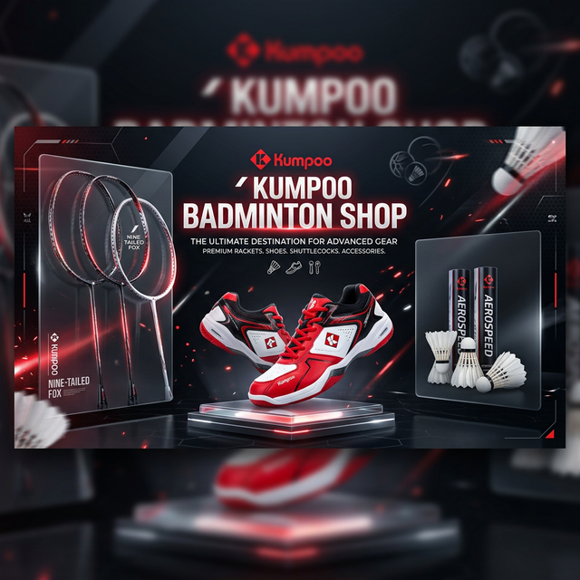

# 🏸 KUMPOO BADMINTON SHOP 🏸

<div align="center">
  

  <br>

  [](https://github.com/MinhNguyen-code/ShopVotCauLongKumpoo)
  [](https://github.com/MinhNguyen-code/ShopVotCauLongKumpoo)
  [](https://opensource.org/licenses/MIT)

  <br>

  

</div>

---

## 🌟 Overview
**Kumpoo Badminton Shop** là nền tảng thương mại điện tử chuyên nghiệp cung cấp các dòng sản phẩm cầu lông chính hãng từ thương hiệu Kumpoo Nhật Bản. Được xây dựng với trải nghiệm người dùng tối ưu, giao diện hiện đại và các tính năng thông minh.

> [!TIP]
> Trải nghiệm website tốt nhất ở chế độ **Dark Mode** để cảm nhận sự chuyên nghiệp!

---

## 🚀 Tính Năng Nổi Bật

<div align="center">
<table>
  <tr>
    <td align="center"><b>🌓 Dark Mode</b></td>
    <td align="center"><b>🌐 Đa Ngôn Ngữ</b></td>
    <td align="center"><b>🛒 Giỏ Hàng</b></td>
  </tr>
  <tr>
    <td align="center"></td>
    <td align="center"></td>
    <td align="center"></td>
  </tr>
  <tr>
    <td align="center">Chuyển đổi sáng/tối mượt mà</td>
    <td align="center">Hỗ trợ Tiếng Việt & Tiếng Anh</td>
    <td align="center">Quản lý đơn hàng thông minh</td>
  </tr>
</table>
</div>

### 💎 Các đặc điểm khác:
*   **Glassmorphism UI**: Giao diện kính mờ sang trọng, hiện đại.
*   **Responsive Design**: Tương thích hoàn hảo từ Mobile đến Desktop.
*   **Product Filter**: Lọc sản phẩm theo danh mục cực nhanh.
*   **Auth System**: Hệ thống Đăng nhập / Đăng ký lưu trữ qua LocalStorage.
*   **Animated Slider**: Banner slider mượt mà với hiệu ứng chuyển cảnh cao cấp.

---

## 📖 Tài Liệu Tham Khảo
Nếu bạn là developer muốn tìm hiểu chi tiết về cấu trúc code, hãy xem file:
👉 [**Huong-Dan-Code.md**](./Huong-Dan-Code.md)

---

## 🛠️ Tech Stack

<div align="center">


| Công nghệ | Mục đích |
| :-- | :-- |
| **Vanilla JS** | Logic giỏ hàng, Auth, Đa ngôn ngữ |
| **Advanced CSS** | Glassmorphism, Animation, Flex/Grid |
| **LocalStorage** | Lưu trữ dữ liệu phiên làm việc |
| **Google Fonts** | Font *Outfit* chuẩn UX/UI |

</div>

---

## 📸 Hình Ảnh Dự Án

<div align="center">
  
  <p><i>Giao diện Home Page với Slider mượt mà</i></p>
</div>

---

## 🛠️ Cài Đặt & Chạy Local

1.  **Clone Repository**
    ```bash
    git clone https://github.com/MinhNguyen-code/ShopVotCauLongKumpoo.git
    ```
2.  **Truy cập thư mục**
    ```bash
    cd ShopVotCauLongKumpoo
    ```
3.  **Mở với trình duyệt**
    - Mở file `index.html` trực tiếp hoặc sử dụng **Live Server** trên VS Code.

---

## 👨‍💻 Tác Giả

**Minh Nguyễn**
*   GitHub: [@MinhNguyen-code](https://github.com/MinhNguyen-code)
*   Email: [example@email.com](mailto:example@email.com)

---

<div align="center">
  
  <p>Cảm ơn bạn đã ghé thăm project!</p>
</div>
